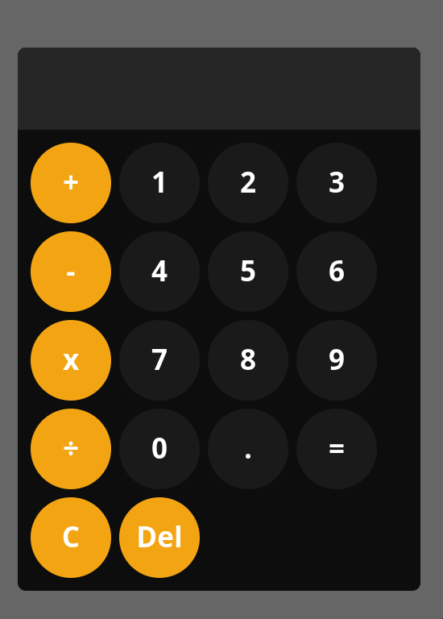
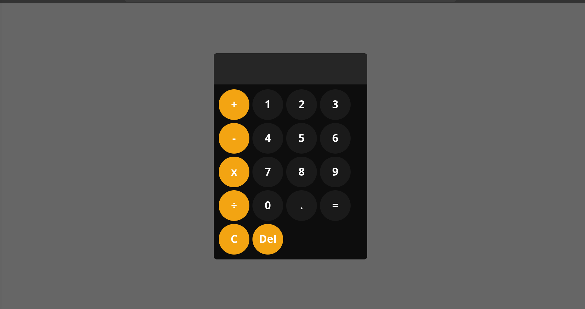

# Calculator

This is a simple calculator project built with HTML, CSS, and JavaScript. It provides basic arithmetic operations like addition, subtraction, multiplication, and division.

## Features

- User-friendly interface
- Basic arithmetic operations (addition, subtraction, multiplication, division)
- Clear button to reset the display
- Responsive design

## Screenshot
## Mobile-design

## Desktop-design

## Technologies Used

- HTML5
- CSS3
  - Flexbox
  - CSS Grid
  - Custom Properties
- JavaScript
